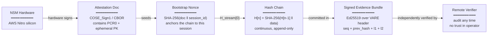
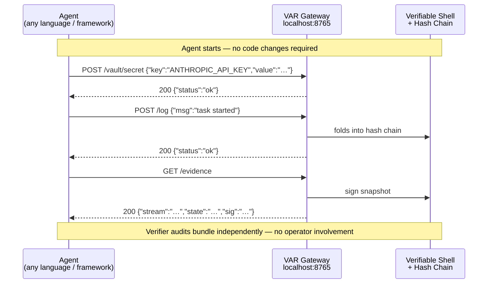
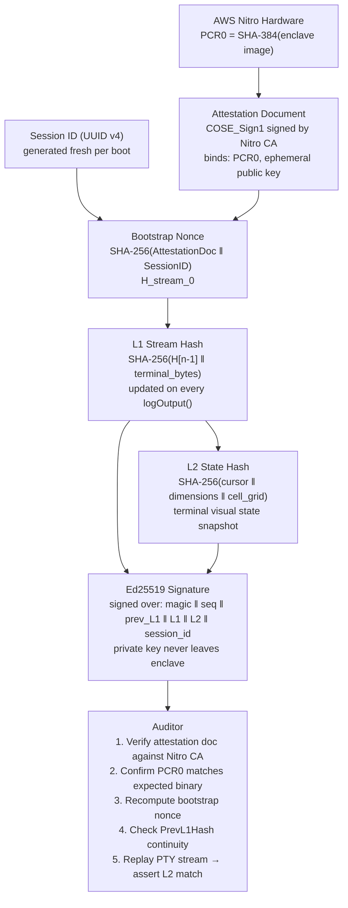

# Verifiable Agent Runtime (VAR)

**AI agents running in production today have no way to prove what they actually did.**

They run with high-privilege credentials, on infrastructure you don't control, and produce logs that any compromised host can silently alter. When something goes wrong — or when a regulator asks — there is no cryptographic record you can point to.

VAR solves this. It wraps any autonomous agent in a hardware-enforced trust boundary, produces a continuous cryptographic evidence chain of everything the agent did, and lets any external party verify that chain without trusting the host, the operator, or the agent itself.

---

## How it works — in three steps

```
1. ATTEST   Hardware certifies the exact binary running inside the enclave.
            A remote verifier can confirm it has not been tampered with
            before sending a single credential.

2. RUN      The agent executes normally — any language, any framework.
            Every byte of terminal output is folded into a live hash chain
            signed by a key that never leaves the enclave.

3. VERIFY   Anyone with the evidence bundle can independently replay the
            session and confirm that the signed hashes match — after the
            fact, without trusting any single party.
```

---

## Why this matters

The emerging market for autonomous AI agents — coding agents, financial agents, infrastructure agents — will require the same auditability guarantees that regulated industries already demand of human operators. The tooling does not exist yet. VAR is that tooling.

It is not an SDK you ask developers to adopt. It is a **sidecar** that wraps whatever the agent is already running — a trust upgrade that is invisible to the application layer.

---

## The three pillars

### 1. TEE / Silicon Isolation

The agent runtime executes inside a **Trusted Execution Environment** (AWS Nitro Enclave today; ARM CCA in the roadmap). The host operating system cannot read or modify the enclave's memory, even with root access.

```
┌─────────────────────────────────────────────────────────────┐
│                    UNTRUSTED ZONE                           │
│                                                             │
│   ┌─────────────────┐        ┌────────────────────────┐    │
│   │   Agent Process  │        │     Host Proxy          │    │
│   │  (any language)  │        │  (Python / Go / etc.)   │    │
│   └────────┬─────────┘        └───────────┬────────────┘    │
│            │ HTTP REST (loopback)          │ vsock           │
└────────────┼──────────────────────────────┼─────────────────┘
             │                              │
┌────────────┼──────────────────────────────┼─────────────────┐
│            │    TRUSTED EXECUTION ENV     │                 │
│            ▼                              ▼                 │
│   ┌─────────────────┐        ┌────────────────────────┐    │
│   │ HTTP Gateway    │        │   Secure Vault          │    │
│   │  :8765          │        │ (memory-only, wiped on  │    │
│   │                 │        │  process exit)          │    │
│   └────────┬────────┘        └────────────────────────┘    │
│            │                                                │
│   ┌────────▼────────────────────────────────────────────┐  │
│   │   Verifiable Shell  ──  Hash Chain  ──  Ed25519 Key  │  │
│   └────────────────────────────────────────────────────-─┘  │
│                                                             │
│   ┌─────────────────────────────────────────────────────┐  │
│   │   NSM  (Nitro Secure Module — hardware only)         │  │
│   └─────────────────────────────────────────────────────┘  │
└─────────────────────────────────────────────────────────────┘
```

What the hardware boundary buys you:

| Without TEE | With VAR |
|---|---|
| Host OS can read credentials in memory | Credentials only exist inside the enclave |
| Host OS can alter or suppress logs | Logs are hash-chained and hardware-signed |
| "Trust us" audit trail | Cryptographic proof any third party can verify |

---

### 2. Remote Attestation Proofs

Before the first credential is sent, a remote verifier can ask the hardware itself: *"Is this the exact binary I expect, running unmodified?"* This is **remote attestation**, and it is the root of trust for the entire session.



**What the chain proves:**

- **PCR0** — the SHA-384 measurement of the enclave image. Any modification to the binary changes this value; the attestation document becomes invalid.
- **Bootstrap Nonce** — `SHA-256(attestation_doc ‖ session_id)`. Ties the hash chain to a specific hardware instance and session. A replay of a different session produces a different nonce and fails verification.
- **Continuity** — each evidence packet includes `PrevL1Hash`. A gap or reorder is immediately detectable; there is no way to delete or reorder entries without breaking the chain.
- **L2 / Terminal State** — the visual state of the terminal is independently hashed at each snapshot. A verifier can replay the raw byte stream through any VT parser and assert it produces the same signed state digest.

---

### 3. POSIX Compatibility

VAR runs as a **sidecar process** alongside any existing agent. There is no SDK to install, no language runtime to replace, and no application code to change.



The HTTP gateway binds to loopback inside the enclave. From the agent's perspective it is a plain JSON REST API. From the verifier's perspective every response to `/evidence` is a cryptographically signed snapshot of the full session.

---

## Trust chain — end to end



---

## Threat model

**What VAR protects against:**

- A compromised host OS reading credentials from the agent process
- A compromised host OS tampering with or suppressing log entries
- An operator retroactively altering the evidence record
- A replay attack presenting evidence from a different session as current

**What VAR does not protect against (current scope):**

- A compromised agent *application* (if the agent itself is malicious, it will produce a verifiable record of its malicious actions — which is still useful, but not a prevention control)
- Side-channel attacks against the enclave (Nitro's responsibility)
- Availability — a host can still terminate the enclave; it simply cannot tamper with the evidence already emitted

---

## Getting started

### Prerequisites

- Zig `0.15.x`
- Python 3.x (host proxy)
- AWS Nitro-compatible instance, or any Linux machine (simulation mode auto-activates when `/dev/nsm` is absent)

### Build

```bash
zig build
# Produces:
#   zig-out/bin/VAR          — vsock line-protocol runtime
#   zig-out/bin/VAR-gateway  — HTTP REST gateway (recommended for new integrations)
```

### Run — simulation mode (no AWS account needed)

Simulation mode activates automatically when `/dev/nsm` is absent. The KMS
proxy is not required; DEK wrapping uses a local mock key.

```bash
# Terminal 1 — HTTP gateway (listens on 127.0.0.1:8765)
./zig-out/bin/VAR-gateway
```

### Run — production mode (AWS Nitro)

```bash
# Terminal 1 — host-side KMS proxy (on the parent EC2 instance)
VAR_KMS_KEY_ARN=arn:aws:kms:us-east-1:123456789012:key/… \
AWS_DEFAULT_REGION=us-east-1 \
python3 src/host/proxy.py --vsock

# Terminal 2 — launch the enclave image (after packaging with nitro-cli)
nitro-cli run-enclave \
  --enclave-cid 16 \
  --memory 512 \
  --cpu-count 2 \
  --eif-path var.eif
```

See `src/host/var-kms-proxy.service` for the systemd unit that manages the
proxy in production, and the **Deployment** section below for KMS key policy
setup.

### Environment variables

| Variable | Component | Default | Description |
| :--- | :--- | :--- | :--- |
| `VAR_KMS_KEY_ARN` | enclave | — | ARN of the KMS CMK used to wrap the DEK |
| `VAR_KMS_PROXY_PORT` | enclave + proxy | `8443` | vsock/TCP port for the KMS proxy |
| `AWS_DEFAULT_REGION` | proxy | from credential chain | AWS region for KMS calls |
| `VAR_GATEWAY` | verifier | `http://127.0.0.1:8765` | Gateway URL for `verify_evidence.py` |

### HTTP Gateway API

The `VAR-gateway` binary exposes a JSON REST API on `127.0.0.1:8765`.

| Method | Path | Body / Notes | Response |
| :--- | :--- | :--- | :--- |
| `GET` | `/health` | — | `{"status":"healthy"}` |
| `GET` | `/session` | — | `{"magic","version","session_id","bootstrap_nonce"}` |
| `GET` | `/attestation` | — | `{"pcr0","public_key","doc"}` (hex-encoded) |
| `GET` | `/evidence` | — | `{"prev_stream","stream","state","sig","sequence"}` |
| `POST` | `/vault/secret` | `{"key":"…","value":"…"}` | `{"status":"ok"}` |
| `POST` | `/log` | `{"msg":"…"}` + `X-Skill-Id` header | `{"status":"ok"}` |

Every `POST /log` call extends the L1 hash chain. Every `GET /evidence`
returns a signed snapshot of the current chain state. See `evidence_spec.md`
for the full wire format.

### Verify a session

```bash
# Human-readable output
python3 src/agent/verify_evidence.py

# Machine-readable JSON (for CI / automated auditing)
python3 src/agent/verify_evidence.py --json
```

---

## Project structure

```
src/
├── main.zig                    Enclave entry point (vsock line protocol)
├── http_main.zig               HTTP gateway entry point
├── runtime/
│   ├── http.zig                REST gateway (/vault/secret, /log, /evidence, /session, /health)
│   ├── shell.zig               Verifiable PTY — L1 hash chain + Ed25519 signing
│   ├── vt.zig                  VT100/ANSI state machine and L2 terminal digest
│   ├── vault.zig               Memory-only credential store (wiped on exit)
│   ├── sealed_state.zig        Hibernate/resume — AES-256-GCM + KMS DEK wrapping
│   ├── rsa_recipient.zig       RSA-2048 keygen + OAEP unwrap (KMS recipient flow)
│   ├── attestation.zig         Hardware identity and NSM attestation quote
│   ├── nsm.zig                 Nitro Secure Module driver + simulation fallback
│   ├── vsock.zig               AF_VSOCK host–enclave transport
│   └── protocol.zig            Handshake, bundle header, secret delivery
├── host/
│   ├── proxy.py                KMS forwarding proxy (vsock → boto3 → KMS)
│   ├── requirements.txt        Runtime deps (boto3)
│   ├── requirements-dev.txt    Test deps (moto, pytest)
│   ├── var-kms-proxy.service   Systemd unit for the proxy on the parent instance
│   └── tests/
│       └── test_proxy.py       Proxy tests (pytest + moto)
└── agent/
    ├── verify_evidence.py      Standalone evidence verifier (--json for CI)
    ├── agent.py                Example vsock agent
    ├── gateway_skill.py        Example HTTP gateway skill
    └── tests/
        └── test_verify_evidence.py  Verifier tests (30 cases, real Ed25519)
evidence_spec.md                Formal specification of the evidence wire format (v1.2)
```

---

## License

MIT
