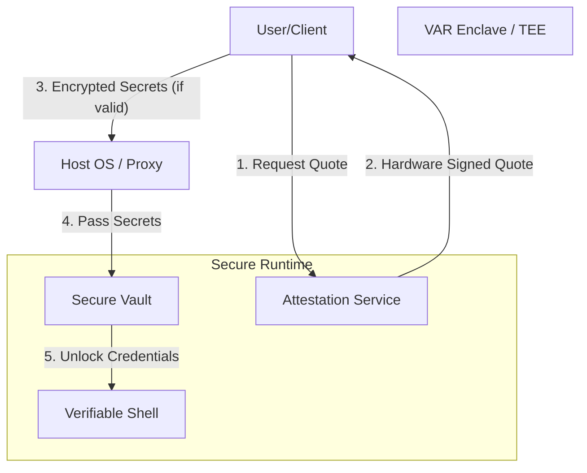
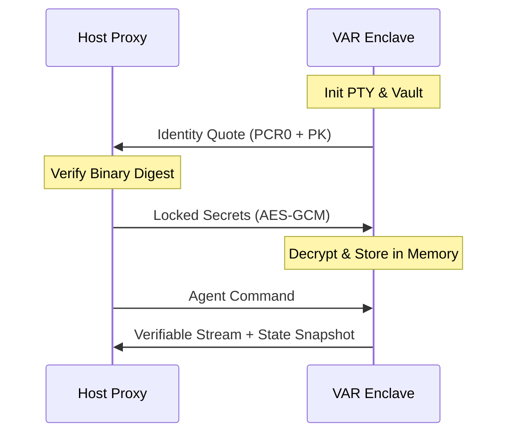

# Verifiable Agent Runtime (VAR)

Verifiable Agent Runtime (VAR) is a secure-by-default execution environment for autonomous AI agents. It leverages Zig and Trusted Execution Environments (TEEs) to provide cryptographic guarantees for credential management and execution integrity.

## Core Value Proposition

Autonomous agents require high-privilege credentials to perform meaningful work. VAR eliminates the need to trust the host operating system by isolating agents within a TEE and providing verifiable proofs of their session.

## System Architecture

### Trust Model

The VAR architecture establishes trust through two main components: Input Trust and Output Trust.



### Communication Layer

VAR uses AF_VSOCK for guest-host communication. This approach bypasses the standard network stack, significantly reducing the attack surface.



## Technical Implementation

- **Runtime**: Implemented in Zig for deterministic execution and low-level systems control.
- **Input Trust**: Remote Attestation via hardware-signed quotes (e.g., AWS Nitro Enclaves, ARM CCA).
- **Output Trust**: A hash-chained terminal logger that serializes visual state snapshots, preventing log tampering.
- **Storage**: Memory-only Secure Vault that wipes credentials on process termination.

## Getting Started

### Prerequisites

- Zig 0.15.2
- Python 3.x (for the host proxy)

### Building the Enclave

```bash
zig build-exe src/main.zig --name var_enclave
```

### Running the Environment

1. Start the Host Proxy:
```bash
python3 src/host/proxy.py
```

2. Run the Enclave Runtime:
```bash
./var_enclave
```

## Project Structure

- `src/main.zig`: Enclave entry point and lifecycle management.
- `src/runtime/`:
    - `shell.zig`: Verifiable PTY master.
    - `vt.zig`: Terminal state machine and serialization logic.
    - `vault.zig`: Memory-resident credential storage.
    - `attestation.zig`: Hardware identity and binary digest generation.
    - `vsock.zig`: Enclave-ready communication abstraction.
- `src/host/`:
    - `proxy.py`: Connectivity bridge for the host OS.

## License

MIT
